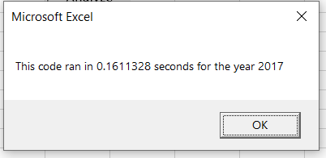
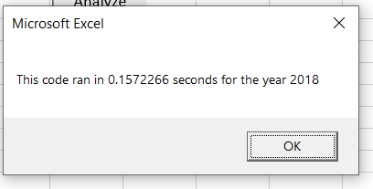

# VBA of Wall Street

## Overview of Project

### Purpose

The purpose of this analysis is to calculate volume and return on the entire stock market over the last few years. This will allow Steve to do as much research as possible for
creating his parent's porfolio.

## Results

### Refactoring Speed Up

To speed up our code, we removed the nesting in our for loops, changing the order of the analysis.
Instead of looping through every row for every ticker name, we loop through every row taking note of the ticker name and saving the information in an array.

```
  For i = 2 To RowCount
    
        '7a) Increase volume for current ticker
        tickerVolumes(tickerIndex) = tickerVolumes(tickerIndex) + Cells(i, 9).Value
        
        '7b) Check if the current row is the first row with the selected tickerIndex.
        If Cells(i - 1, 2).Value <> tickers(tickerIndex) And Cells(i, 2).Value = tickers(tickerIndex) Then

            tickerStartingPrices(tickerIndex) = Cells(i, 7).Value

        End If

        
        '7c) check if the current row is the last row with the selected ticker
        If Cells(i + 1, 2).Value <> tickers(tickerIndex) And Cells(i, 2).Value = tickers(tickerIndex) Then

            tickerEndingPrices(tickerIndex) = Cells(i, 7).Value
            '7d) Increase the tickerIndex.
            tickerIndex = tickerIndex + 1

        End If
    
    Next i
 ```
 
 The above loop accomplish both goals in one pass, instead of passing over all row for every tickers
 
 The original code ran in ~0.8 secs. Below are the times for the new function.




This is an over 5x speed up.

## Summary

- What are the advantages or disadvantages of refactoring code?

The advanteage of refactoring code is that it can greatly cut down on the runtime of your code. The disadvantage is that it does take time and resources to refactor.
Therefore it is probably not necessary if it is a code block that won't be run many times, or won't be run on a large data set.

- How do these pros and cons apply to refactoring the original VBA script?

The VBA script would not need to be refactored if we were only running 12 tickers, but since we are expanding to the entire stock market it is important to refactor the code to
run quickly.
